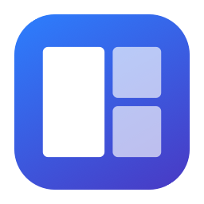

# WindowZones

**Arrange your windows into useful layouts with a drag and drop.**

WindowZones is a small macOS menu bar app that moves and resizes windows into zones.
Drag a window toward the top of your screen, choose a zone in the layout bar and
release. Use two windows side by side, make room for a browser and editor, or pick
another built-in layout without sizing each window by hand.

[Download for macOS](https://github.com/shumer/WindowZones/releases/latest) ·
[Installation](#install-and-enable) · [First steps](#try-it-in-a-minute) ·
[Report a problem](https://github.com/shumer/WindowZones/issues)

**macOS 15+ · Apple Silicon · Early release · App interface currently in Russian**

## What can I do with it?

| When you want to... | Use |
| --- | --- |
| Place a window without opening a separate picker | Drag its title bar toward the top of the screen, then drop onto a zone in the layout bar |
| Choose from four built-in layouts | Open the picker with **Control+Option+Space** or the menu bar icon |
| See the current layout across your screen | Hold **Shift** while dragging a window, then release the mouse inside a zone |
| Reverse the last placement | Choose Undo in the WindowZones menu |
| Keep the app available after signing in | Enable launch at login in Settings |
| Get newer versions | Use Check for Updates, or enable automatic update checks |

Each placement affects the window you selected. Other windows stay where you left
them. WindowZones remembers the selected layout for each display. It does not
restore a workspace of apps or documents when you sign in.

## Install and enable

You do not need Xcode, Homebrew or an Apple Developer account.

1. Open the [latest release](https://github.com/shumer/WindowZones/releases/latest)
   and download **WindowZones-<version>-arm64.zip** from **Assets**.
   Choose the app ZIP, not GitHub's Source code archive.
2. Unzip the download and drag **WindowZones.app** into **Applications**.
3. Launch **WindowZones from Applications**. It runs from the menu bar.
4. In its settings, click **Открыть Accessibility** (Open Accessibility).
5. Enable **WindowZones** in **System Settings > Privacy & Security > Accessibility**.
   If it is missing, add the copy in Applications, then return to WindowZones.

Accessibility lets WindowZones move and resize the windows you choose. Without it,
the app can open its settings but cannot arrange other apps' windows.

Release downloads are Developer ID signed and notarized by Apple.

## Try it in a minute

1. Open a regular Finder window.
2. Grab a free area of its title bar and drag it toward the top of the screen.
3. When the layout bar appears, move over a zone and release the mouse.
4. Repeat with a second window and choose another zone to arrange them side by side.
5. To reverse the last placement, open the WindowZones menu and choose its Undo command.

Prefer a picker? Activate the window you want to move, press **Control+Option+Space**,
and click a zone. Press **Escape** to cancel. The menu bar also has a command to open
this picker if the shortcut conflicts with another app.

For **Shift-drag**, hold Shift while moving the window. Release the mouse inside a
highlighted zone to place it. Press Escape or release Shift before the mouse button
to cancel snapping and keep your ordinary drag.

## Make it yours

Open **Настройки…** (Settings) from the WindowZones menu:

- **Запускать при входе в систему** enables launch at login.
- **Проверять обновления автоматически** enables automatic update checks.
- **Проверить обновления…** checks for a new version immediately.

Launch at login and automatic update checks start off. Updates use Sparkle to
download, install and relaunch the app. You can also download a release manually.

The menu includes a toggle for the top drag bar and Shift-drag, plus a choice
between **Control+Option+Space** and **Control+Shift+Space** for the picker.

## Questions and fixes

**The layout bar does not appear.** Check Accessibility and the drag toggle in the
WindowZones menu. Start from a free part of the window's title bar. Very fast drag
starts may be missed in this early release; try a slower start or use the picker.

**A window does not fit the zone exactly.** Some apps enforce a minimum size or
restrict resizing. Try a larger zone. If a regular resizable window consistently
lands incorrectly, report the app and the layout you used.

**The keyboard shortcut does nothing.** Open the picker from the menu bar to check
that window placement works, then try the alternate shortcut in that menu.

**How does Undo work?** WindowZones remembers its last successful placement during
the current session. Use its own Undo command, not another app's Command-Z. Restarting
WindowZones clears that history. A closed window cannot be restored.

**Can I create my own layouts?** Not yet. Version 0.1 includes four built-in layouts.
A custom layout editor is planned.

**How do I uninstall?** Turn off launch at login if you enabled it, quit WindowZones
from its menu, then move the app from Applications to Trash. Layout data remains in
`~/Library/Application Support/WindowZones`.

## Compatibility and project status

WindowZones 0.1 is an early release for Apple Silicon running macOS 15 or later.
Real window-placement checks have covered macOS 26.6.2 and 27.0. Other versions,
more apps and multi-monitor combinations still need broader testing. Intel builds
and full English localization are not included yet.

The published app's signature and notarization were verified. A test copy marked as
an older version successfully downloaded, installed and relaunched into 0.1.0 through
Sparkle. Installation on a clean user profile and a real launch after signing in
still need verification.

When [reporting a problem](https://github.com/shumer/WindowZones/issues), include your
macOS version, WindowZones version, affected app, monitor setup and steps to reproduce.
Remove private window contents from screenshots before sharing them.

## For contributors

The working project documentation is currently in Russian.

- [Build, signing and releases](docs/release/README.md).
- [Current state and verified results](docs/CurrentState.md).
- [Next steps](docs/NextSteps.md) and [task list](docs/tasks/README.md).
- [Product specification](docs/Specification.md) and [drag interaction design](docs/design/DragFlow.md).
- [Repository rules](AGENTS.md).
